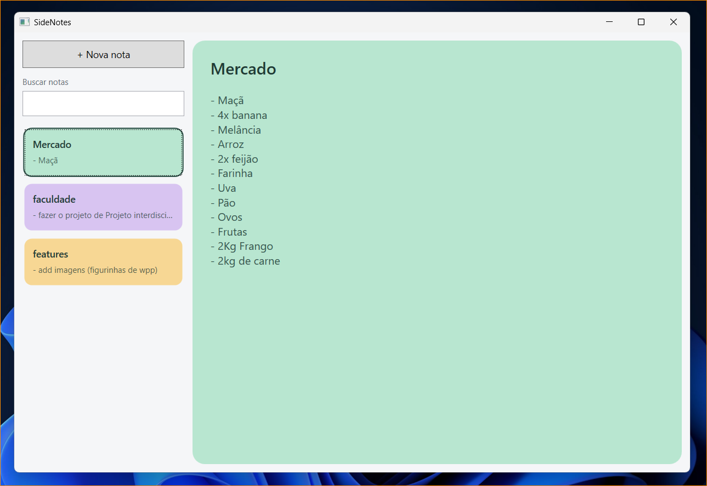

# SideNotes

Aplicativo de notas para Windows desenvolvido em **C# com WPF**, para organizar lembretes e anotações com edição simples e salvamento automático.

O projeto faz parte do meu aprendizado em C#/.NET, com foco em interfaces desktop, binding de dados, separação de responsabilidades e persistência local.

> **Em desenvolvimento:** o modo Janela já permite gerenciar as notas. O modo Desk possui uma janela de protótipo, ainda sem integração com as notas. Novas melhorias visuais estão planejadas.

## Interface atual



## Funcionalidades

- Criação, edição e exclusão de notas com título e conteúdo.
- Cores atribuídas automaticamente a partir de uma paleta.
- Lista com título, prévia do conteúdo e destaque da nota selecionada.
- Busca por título ou conteúdo, sem diferenciar maiúsculas e minúsculas.
- Salvamento automático após um segundo sem digitar.
- Persistência local em JSON.
- Janela redimensionável e mensagens para estados sem seleção ou sem resultados.
- Validação dos dados carregados e preservação de uma cópia de arquivos inválidos.
- Avisos de falha de gravação e confirmação antes de fechar quando não é possível salvar.

## Tecnologias

- C# e .NET 10 (`net10.0-windows`).
- WPF e XAML.
- Binding de dados e `INotifyPropertyChanged`.
- `ObservableCollection` e `ICollectionView`.
- `DispatcherTimer` para o salvamento automático.
- `System.Text.Json` para leitura e gravação dos dados.

## Como executar

### Requisitos

- Windows.
- SDK do .NET 10.
- Para executar pelo Visual Studio: uma versão compatível com .NET 10 e a carga de trabalho **Desenvolvimento para desktop com .NET**.

### Pelo Visual Studio

1. Baixe ou clone este repositório.
2. Abra a solução `SideNotes.slnx`.
3. Defina `SideNotes` como projeto de inicialização, se necessário.
4. Execute com **F5**.

### Pelo terminal

Na pasta raiz do repositório, que contém `SideNotes.slnx`, execute:

```powershell
dotnet run --project ".\SideNotes\SideNotes.csproj"
```

## Como usar

1. Clique em **+ Nova nota** para criar uma anotação.
2. Edite o título e o conteúdo no painel à direita. As alterações são salvas automaticamente.
3. Use **Buscar notas** para localizar uma palavra no título ou no conteúdo. Limpe o campo para mostrar todas as notas novamente.
4. Para excluir, selecione uma nota na lista e pressione **Delete** com o foco na lista. Ao editar um texto, Delete mantém sua função normal de apagar caracteres.

Criar uma nota limpa a busca ativa para que a nova anotação fique visível. Ao excluir, a próxima seleção é escolhida entre as notas visíveis na lista.

## Armazenamento

As notas são armazenadas neste caminho do usuário do Windows:

```text
%LocalAppData%\SideNotes\notes.json
```

Na gravação, o aplicativo escreve primeiro em `notes.json.tmp` e depois substitui o arquivo principal. Ao detectar JSON ou dados inválidos, preserva uma cópia chamada `notes-invalid-<identificador>.json` e informa sua localização.

## Organização do código

O projeto separa o modelo de dados, a interface, o estado da aplicação e o armazenamento, seguindo uma organização baseada em MVVM. Dentro de `SideNotes/`, os arquivos estão agrupados nas pastas `Models`, `ViewModels`, `Views` e `Services`, com namespaces correspondentes (`SideNotes.Models`, `SideNotes.ViewModels`, `SideNotes.Views` e `SideNotes.Services`).

| Arquivo | Responsabilidade |
| --- | --- |
| `App.xaml` e `App.xaml.cs` | Inicialização e tratamento de falhas ao carregar os dados. |
| `Models/Note.cs` | Dados da nota e notificações de alteração. |
| `ViewModels/MainViewModel.cs` | Coleção de notas, seleção, busca, criação, exclusão e salvamento automático. |
| `Views/MainWindow.xaml` | Layout, estilos e bindings da interface. |
| `Views/MainWindow.xaml.cs` | Interações visuais, foco, atalhos e apresentação de avisos. |
| `Views/DeskWindow.xaml` e `Views/DeskWindow.xaml.cs` | Interface e interação do protótipo do modo Desk. |
| `Services/NoteStorage.cs` | Leitura, validação e gravação do arquivo JSON. |

`App.xaml`, `App.xaml.cs` e `AssemblyInfo.cs` permanecem na raiz do projeto.

## Próximas etapas

- [ ] Refinar o comportamento da busca durante a edição de notas.
- [ ] Melhorar o design do modo Janela.
- [ ] Evoluir o protótipo do modo **Desk** para compartilhar as mesmas notas do modo Janela.
- [ ] Permitir selecionar até cinco notas para exibição no Desk.
- [ ] Permitir arrastar o conjunto de notas entre os lados esquerdo e direito da tela.
- [ ] Respeitar a área disponível da tela e a posição da barra de tarefas.
- [ ] Salvar as preferências do Desk, incluindo posição e notas escolhidas.

## Autor

Desenvolvido por **Gabriel Braga** como projeto de aprendizado e portfólio.
